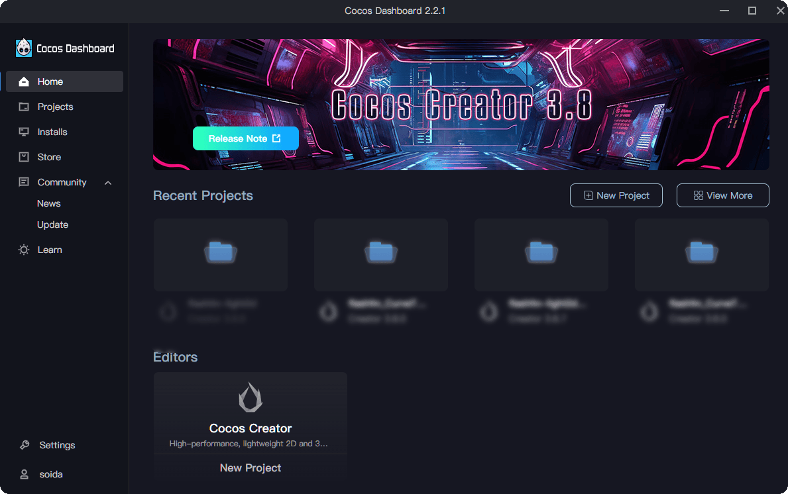
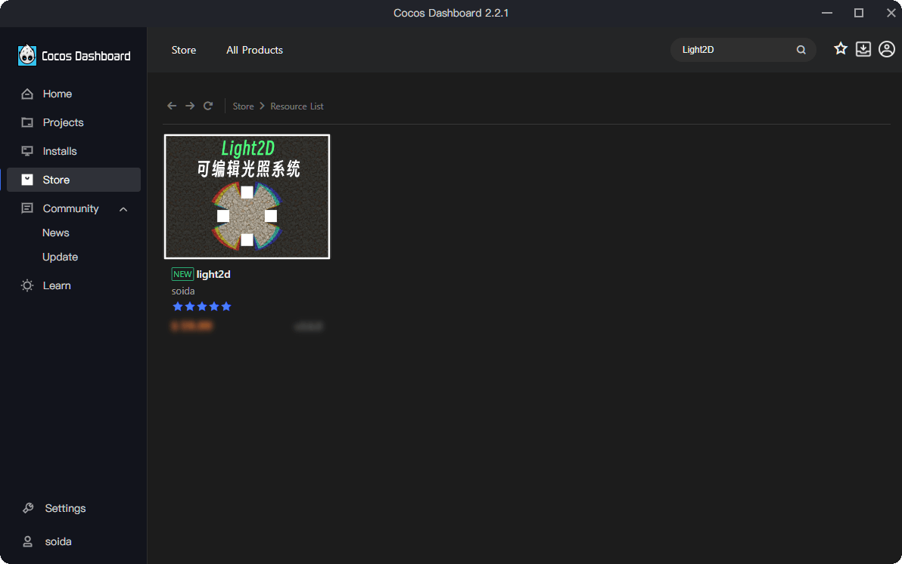
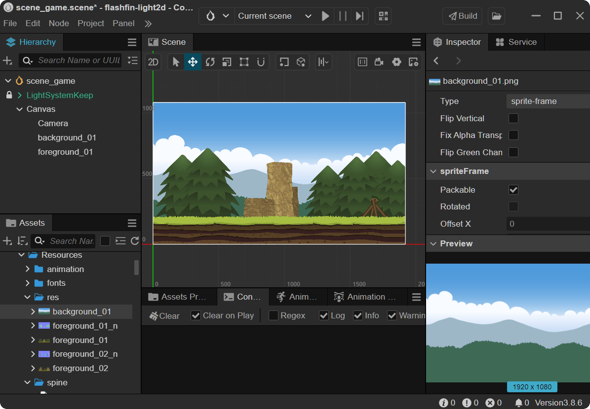
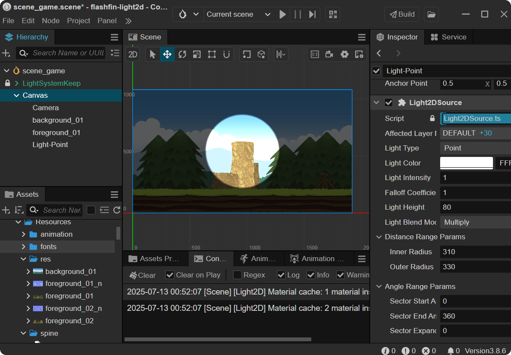
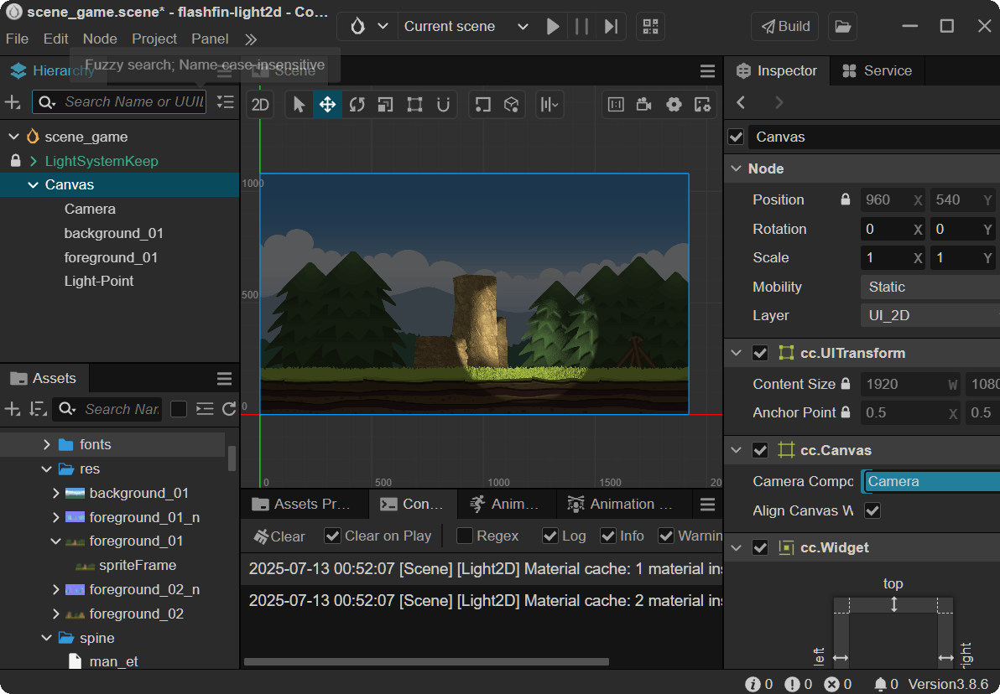
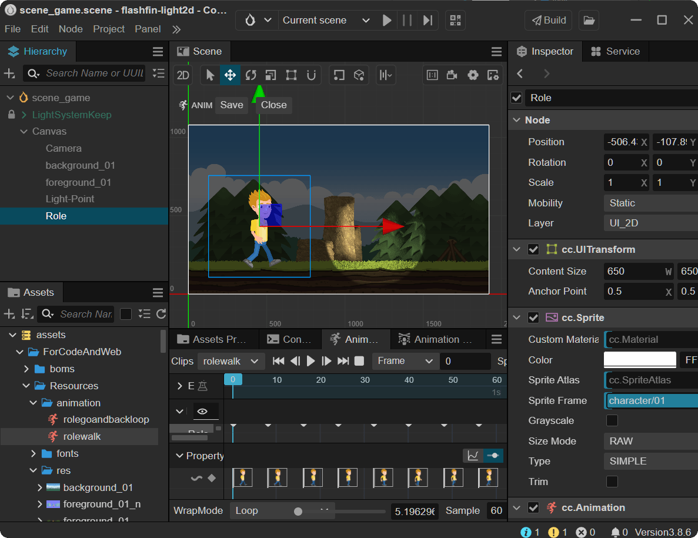
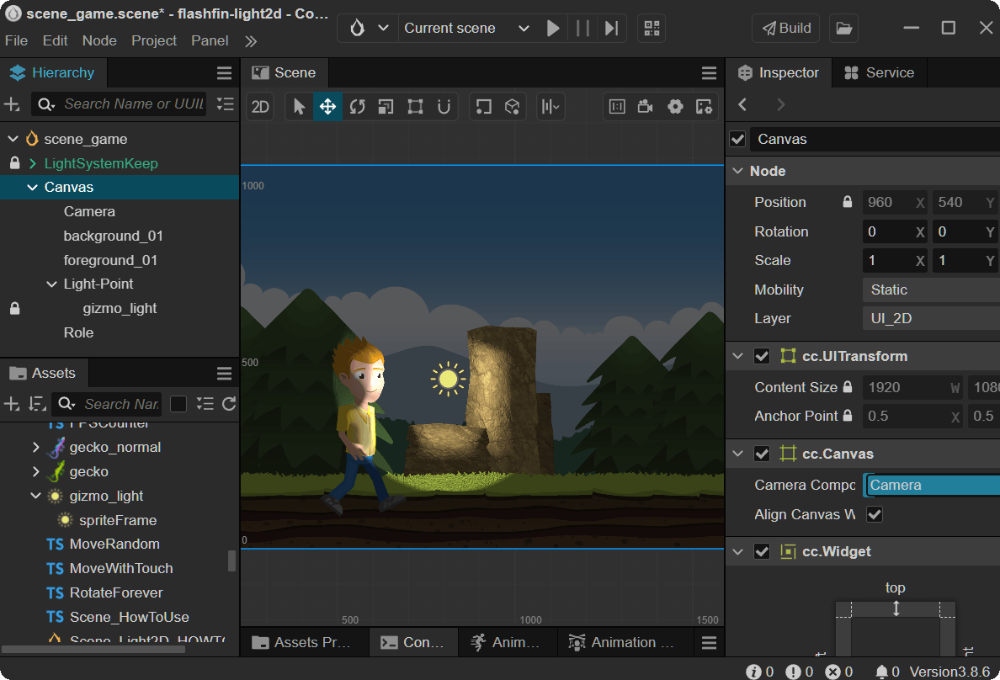
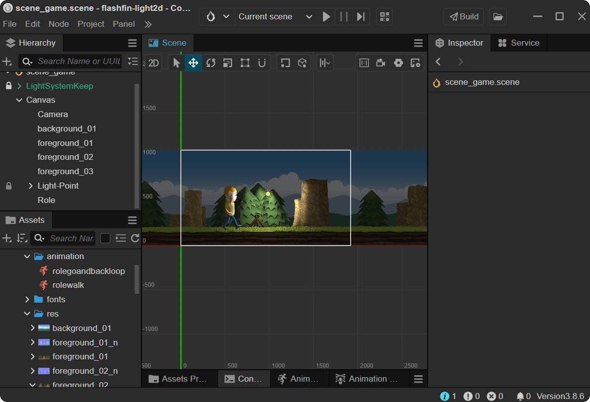
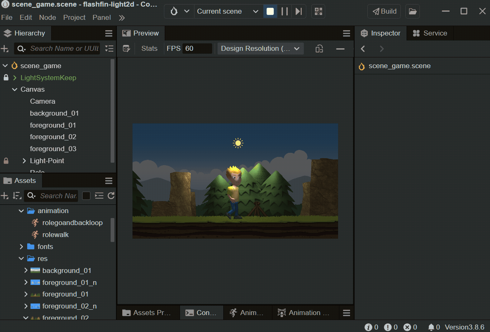

### Creating Dynamic 2D Lighting Effects with the Light2D Plugin for CocosCreator

- author:soida(左泽众)
- flashfin@foxmail.com


##### What you are going to learn

- Create your normal maps + sprite sheets using [SpriteIlluminator](https://www.codeandweb.com/spriteilluminator) and [TexturePacker](https://www.codeandweb.com/texturepacker).
- Load animation frames from a sprite sheet
- Load a normal map sprite sheet and add a light effect to your animation

#### Create your normal maps

The easiest way to create normal maps for your sprites is to use [SpriteIlluminator](https://www.codeandweb.com/spriteilluminator).
For a quick start you simply:

- Drag + drop your sprites on the SpriteIlluminator window
- Select all sprites
- Apply **Bevel** / **Emboss** / **Structure** effects
- Publish the normal map images to the sprite directory, using the \_n suffix

#### Create the sprite sheets

With [TexturePacker](https://www.codeandweb.com/texturepacker) you can pack sprites + normal maps on two different sprite sheets, using the same layout:

- Start TexturePacker and create a new cocos2d project
- Drag + drop sprites and normal maps on the TexturePacker window
- Enable the Pack with same layout option in the Normal Maps section
- Publish the sprite sheets

#### Download CocosCreator Editor

- Go to the official website [CocosCreator](https://www.cocos.com/en/creator-download), click the **Download Cocos DashBoard** button, and your browser will automatically start the download.
- After installing Cocos DashBoard, you may need to register an account and log in to use it.<br>
  
- Install the editor. In the left function list, click the **Installs** button, then click **Install Editor** in the upper right corner. In the pop-up editor version list, select version **3.8.6**. The editor will automatically download and install, and you will receive a system notification when it's done.
- Install the Light2D plugin. In the left function list, click **Store**, search for **Light2D**, and complete the installation and import steps.<br>
  

#### Create the Game Scene

- In the editor, create a brand new empty scene named `scene_game`. Delete the default **MainLight** and **MainCamera**, and create a new **UI Components** / **Canvas**.
- Copy the **LightSystemKeep** node from the sample scene **Scene_Light2D** into your `scene_game` scene.
- Drag some prepared texture assets into the **Canvas** node in the scene. You will see the distant sky/mountains and the foreground ground/rocks/trees.<br>
  

#### Add Light Sources to the Scene

- Select these nodes and add the **Light2DReceiver** component to them. You will notice the scene becomes darker, as they are now affected by the global ambient light.
- Under the **Canvas** node, create a new empty node named **Light-Point** and add the **Light2DSource** component to it. You will see a circular area in the center of the scene illuminated by the default point light. You can adjust different parameters to see the effects.<br>
  
- Set the **ReceiverLayer** of the foreground nodes to **LAYER1**, and set the **AffectLayerList** of the light source to only **LAYER1**. This way, the distant sky background will not be illuminated.
- For the foreground nodes, also enable **EnableNormalMap** and drag in the corresponding normal map texture. You can move the light source node to observe the scene effect.<br>
  

#### Create Character and Animation

- Drag a frame of the character asset into the scene as a new node named **Role**, and add the **Animation** component to it.
- Create the corresponding frame animation **AnimationClip**. After completion, click the run button at the top of the editor to see the character walking in place in the scene.<br>
  

#### Illuminate the Character with the Light Source

- Add the **Light2DReceiver** component to **Role**, and set its **ReceiverLayer** to **LAYER1**.
- Enable **EnableNormalMap** for **Role** and drag in the corresponding normal map texture.<br>
  

#### Make the Character Move

- Add a movement script component **Role.ts** to the **Role** character, so that the character moves to the right for a certain distance, then turns around and moves back, looping this behavior.

```ts
//Role.ts
import { _decorator, Component, tween, Vec3 } from 'cc';
const { ccclass } = _decorator;

@ccclass('role')
export class role extends Component {
  start() {
    tween(this.node)
      .by(16, { position: new Vec3(3400, 0, 0) })
      .call(() => {
        this.node.setScale(this.node.scale.x * -1, this.node.scale.y);
      })
      .by(16, { position: new Vec3(-3400, 0, 0) })
      .call(() => {
        this.node.setScale(this.node.scale.x * -1, this.node.scale.y);
      })
      .union()
      .repeatForever()
      .start();
  }
}
```

- Add a follow script component **FollowForever.ts** to the **Camera** node in the scene, and set **Target Node** to the **Role** node.

```ts
import { _decorator, Component, Node, Vec3 } from 'cc';
const { ccclass, property } = _decorator;
@ccclass('FollowForever')
export class FollowForever extends Component {
  @property(Node)
  public targetNode: Node = null;

  @property({})
  public xFollow = true;

  @property({})
  public yFollow = true;

  private _calcPos: Vec3 = new Vec3();

  protected onEnable(): void {}

  protected update(dt: number): void {
    if (this.targetNode) {
      const targetPos = this.targetNode.worldPosition;
      const currentPos = this.node.worldPosition;
      Vec3.moveTowards(this._calcPos, currentPos, targetPos, 100);
      this.node.setWorldPosition(this.xFollow ? this._calcPos.x : currentPos.x, this.yFollow ? this._calcPos.y : currentPos.y, currentPos.z);
    }
  }
}
```

- Add a rotation script component **RotateForever.ts** to the **Light-Point** node in the scene, and set **Target Node** to the **Role** node.

```ts
import { _decorator, Component, Node, Vec3 } from 'cc';
const { ccclass, property } = _decorator;

@ccclass('RotateForever')
export class RotateForever extends Component {
  @property(Node)
  public targetNode: Node = null;

  @property
  public degSpeed: number = 90;

  private radius: number = 0;
  private angle: number = 0;

  protected onEnable(): void {
    if (this.targetNode) {
      const targetPos = this.targetNode.worldPosition;
      const currentPos = this.node.worldPosition;
      const delta = Vec3.subtract(new Vec3(), targetPos, currentPos);
      this.radius = delta.length();
      this.angle = Math.atan2(delta.y, delta.x) * (180 / Math.PI) + 180;
    }
  }

  protected update(dt: number): void {
    if (this.targetNode) {
      this.angle += dt * this.degSpeed;
      this.angle = this.angle % 360;

      const radian = this.angle * (Math.PI / 180);
      const x = this.radius * Math.cos(radian);
      const y = this.radius * Math.sin(radian);

      const targetPos = this.targetNode.worldPosition;
      this.node.setWorldPosition(targetPos.x + x, targetPos.y + y, 0);
    } else {
      this.node.angle += dt * this.degSpeed;
      this.node.angle = this.node.angle % 360;
    }
  }
}
```

- Adjust the light source parameters: set **InnerRadius** to 4, **OuterRadius** to 900, **LightIntensity** to 2, and **Falloff** to 1, so the light covers a larger area and the attenuation is more natural.
- Add more background and foreground nodes to expand the scene.<br>
  

## 5. Run and Preview the Effect

- Click run to see the vivid lighting scene.<br>
   <br>

## 6. More Lighting Effects and Notes

- The tool used for packing texture assets in the scene: [TexturePacker](https://www.codeandweb.com/texturepacker)
- The tool used for creating all normal maps in the scene: [SpriteIlluminator](https://www.codeandweb.com/spriteilluminator)
- You can preview this game scene online: [ClickMeToView](https://soidaken.github.io/light2d-codeboy/)
- Online preview of the lighting plugin samples: [Light2D-Samples](https://soidaken.github.io/flashfin_Light2D/)
