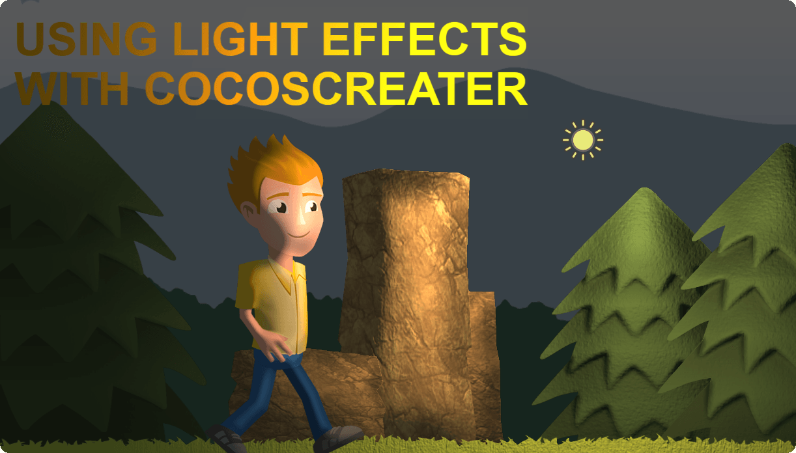
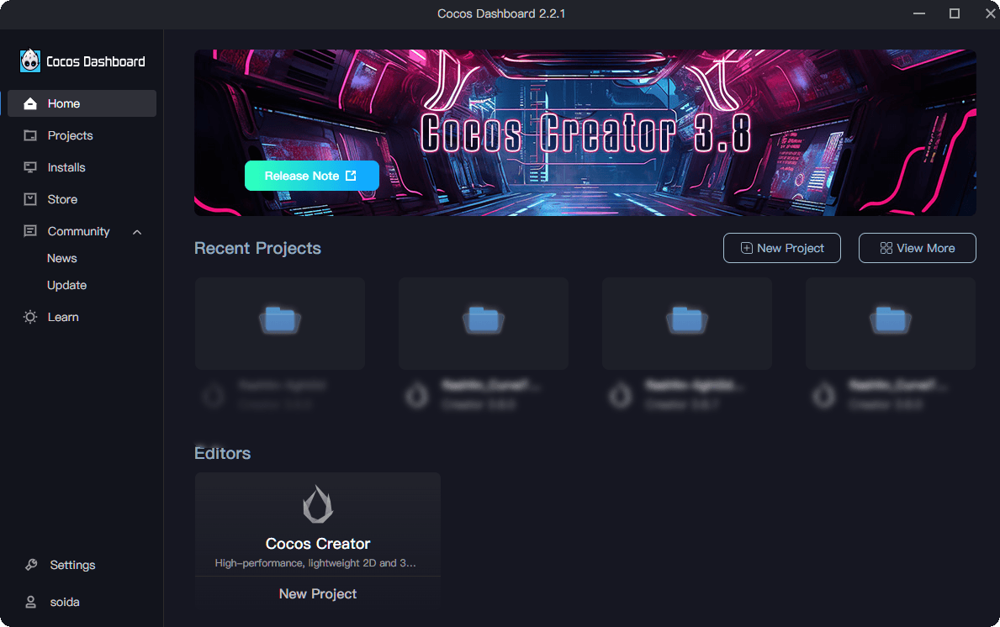
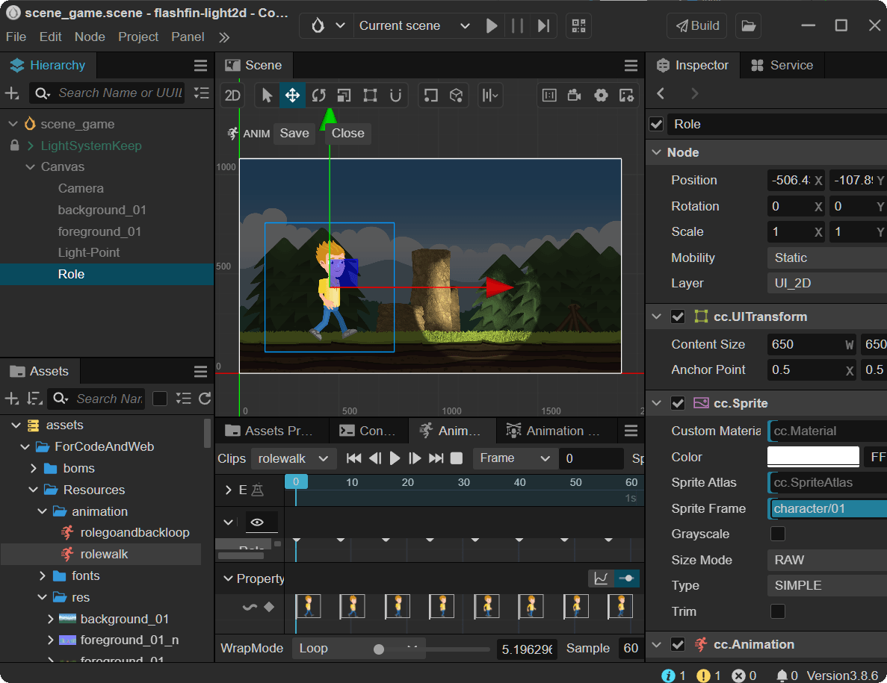
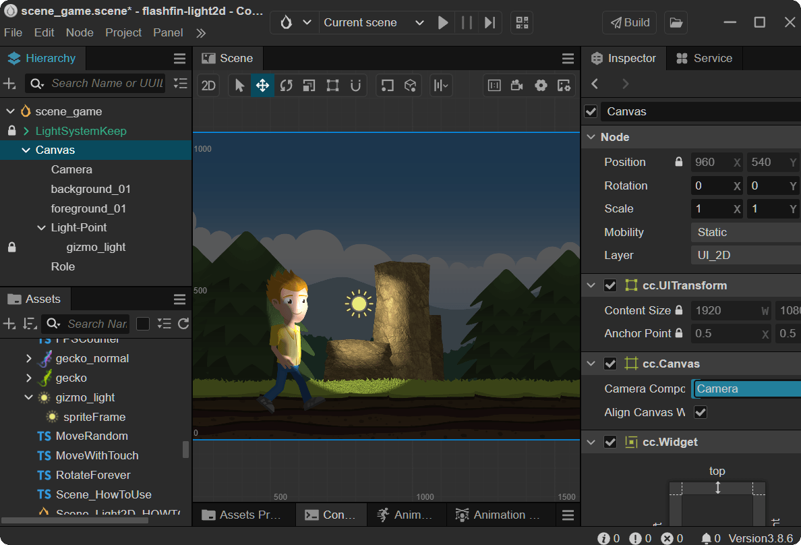
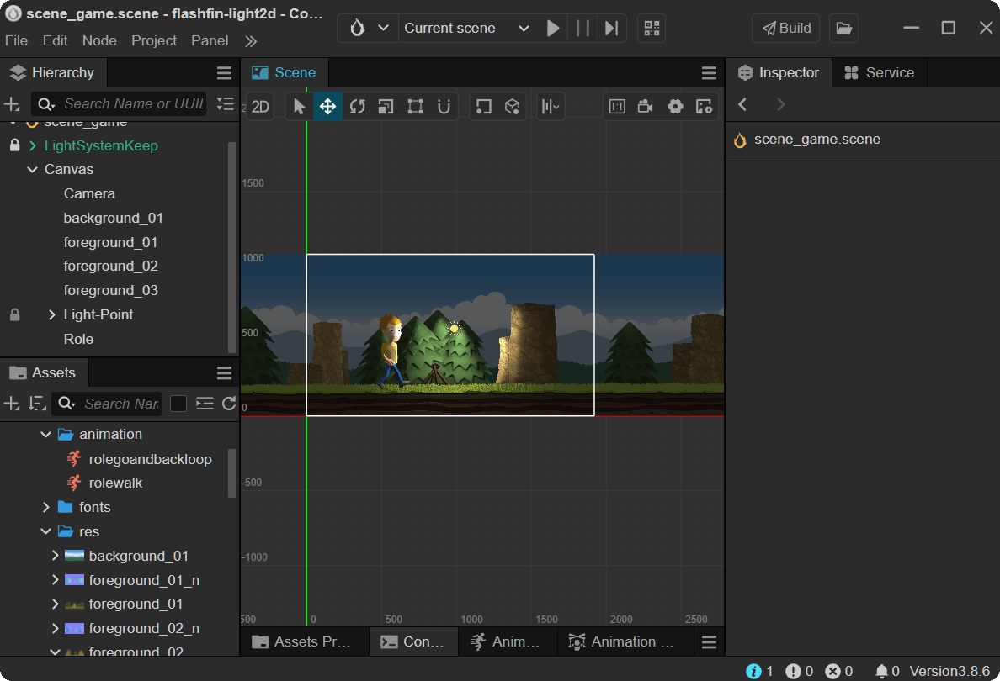
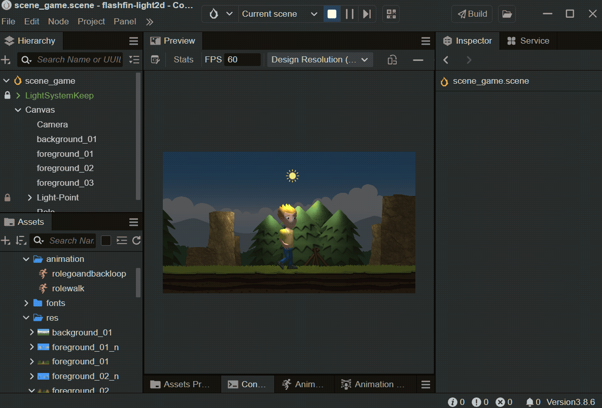

### 基于 CocosCreater 引擎的 Light2D 光照插件制作动态 2D 光照效果



##### What you are going to learn

- Create your normal maps + sprite sheets using [SpriteIlluminator](https://www.codeandweb.com/spriteilluminator) and [TexturePacker](https://www.codeandweb.com/texturepacker).
- Load animation frames from a sprite sheet
- Load a normal map sprite sheet and add a light effect to your animation

#### Create your normal maps

The easiest way to create normal maps for your sprites is to use [SpriteIlluminator](https://www.codeandweb.com/spriteilluminator).
For a quick start you simply:

- Drag + drop your sprites on the SpriteIlluminator window
- Select all sprites
- Apply **Bevel** / **Emboss** / **Structure** effects
- Publish the normal map images to the sprite directory, using the \_n suffix

#### Create the sprite sheets

With [TexturePacker](https://www.codeandweb.com/texturepacker) you can pack sprites + normal maps on two different sprite sheets, using the same layout:

- Start TexturePacker and create a new cocos2d project
- Drag + drop sprites and normal maps on the TexturePacker window
- Enable the Pack with same layout option in the Normal Maps section
- Publish the sprite sheets

#### 下载 CocosCreater 编辑器

- 打开官网 [CocosCreater](https://www.cocos.com/en/creator-download) ,点击按钮 **Download Cocos DashBoard**,浏览器会自动开始下载.
- 完成安装 Cocos DashBoard 后,你可能需要注册一个账号登录使用 <br>
  
- 安装编辑器.在左边的功能列表中,点击 **Installs** 按钮后,继续点击右上角的 **Install Editor** ,在弹出的编辑器版本中选择 **3.8.6** 的版本,编辑器会自动下载安装,完成后会有系统提示.
- 安装 Light2D 插件. 在左边的功能列表中,点击**Store** ,搜索**Light2D**,完成安装导入的步骤. <br>
  

#### 制作游戏场景

- 在编辑器中创建一个全新的空场景 scene_game,删除默认的 **MainLight** 和 **MainCamera**,创建一个新的 **UI Components** / **Canvas**
- 复制样例场景 **Scene_Light2D** 中的 **LightSystemKeep** 节点到我们的 scene_game 场景
- 将一些准备好的资源贴图拖入到场景的**Canvas**节点下,我们就看到了远处的天空/山峦和近处的地面/石头/树木 <br>
  

#### 添加光源到场景

- 分别选中这几个节点,为它们添加 **Light2DReceiver** 组件,会发现画面变暗了,这是因为他们接收到了全局的环境光照的影响.
- 在**Canvas**节点下新建一个空的节点**Light-Point**,为这个节点添加**Light2DSource**组件,会看到画面中心圆形范围内被照亮,这是默认的点光源生效了,可以调节不同的参数查看效果<br>
  
- 设置前景节点的**ReceiverLayer**为 **LAYER1** ,设置光源的 **AffectLayerList**为只有**LAYER1**,这样远处的天空背景就不会被照亮.
- 继续给前景节点勾选 **EnableNormalMap**同时拖入对应的法线纹理,可以移动光源节点查看场景效果.<br>
  

#### 制作角色和动画

- 拖入角色资源的一帧到场景作为一个新的节点 **Role** ,为它添加动画 **Animation** 组件.
- 制作对应的帧动画 **AnimationClip**,完成后,点击编辑器上方的运行按钮,可以看到画面中角色在原地行走.<br>
  

#### 让光源照亮角色

- 为**Role** 添加 **Light2DReceiver**组件,设置节点的**ReceiverLayer**为 **LAYER1**.
- 为**Role** 添加勾选 **EnableNormalMap**同时拖入对应的法线纹理. <br>
  

#### 让角色动起来

- 为 **Role** 角色添加一个移动的脚本组件 **Role.ts** ,让角色向右移动一段距离,然后转身回来,如此循环.

```
//Role.ts
import { _decorator, Component, tween, Vec3 } from 'cc';
const { ccclass } = _decorator;

@ccclass('role')
export class role extends Component {
  start() {
    tween(this.node)
      .by(16, { position: new Vec3(3400, 0, 0) })
      .call(() => {
        this.node.setScale(this.node.scale.x * -1, this.node.scale.y);
      })
      .by(16, { position: new Vec3(-3400, 0, 0) })
      .call(() => {
        this.node.setScale(this.node.scale.x * -1, this.node.scale.y);
      })
      .union()
      .repeatForever()
      .start();
  }
}
```

- 为场景中的摄像机节点 **Camera** 添加一个跟随的脚本组件 **FollowForever.ts**,设置**Target Node**为**Role**节点.

```
import { _decorator, Component, Node, Vec3 } from 'cc';
const { ccclass, property } = _decorator;
@ccclass('FollowForever')
export class FollowForever extends Component {
  @property(Node)
  public targetNode: Node = null;

  @property({})
  public xFollow = true;

  @property({})
  public yFollow = true;

  private _calcPos: Vec3 = new Vec3();

  protected onEnable(): void {}

  protected update(dt: number): void {
    if (this.targetNode) {
      const targetPos = this.targetNode.worldPosition;
      const currentPos = this.node.worldPosition;
      Vec3.moveTowards(this._calcPos, currentPos, targetPos, 100);
      this.node.setWorldPosition(this.xFollow ? this._calcPos.x : currentPos.x, this.yFollow ? this._calcPos.y : currentPos.y, currentPos.z);
    }
  }
}
```

- 为场景中的光源节点 **Light-Point** 添加一个旋转的脚本组件 **RotateForever.ts** ,设置**Target Node**为**Role**节点.

```
import { _decorator, Component, Node, Vec3 } from 'cc';
const { ccclass, property } = _decorator;

@ccclass('RotateForever')
export class RotateForever extends Component {
  @property(Node)
  public targetNode: Node = null;

  @property
  public degSpeed: number = 90;

  private radius: number = 0;
  private angle: number = 0;

  protected onEnable(): void {
    if (this.targetNode) {
      const targetPos = this.targetNode.worldPosition;
      const currentPos = this.node.worldPosition;
      const delta = Vec3.subtract(new Vec3(), targetPos, currentPos);
      this.radius = delta.length();
      this.angle = Math.atan2(delta.y, delta.x) * (180 / Math.PI) + 180;
    }
  }

  protected update(dt: number): void {
    if (this.targetNode) {
      this.angle += dt * this.degSpeed;
      this.angle = this.angle % 360;

      const radian = this.angle * (Math.PI / 180);
      const x = this.radius * Math.cos(radian);
      const y = this.radius * Math.sin(radian);

      const targetPos = this.targetNode.worldPosition;
      this.node.setWorldPosition(targetPos.x + x, targetPos.y + y, 0);
    } else {
      this.node.angle += dt * this.degSpeed;
      this.node.angle = this.node.angle % 360;
    }
  }
}
```

- 调节光源参数,设置**InnerRadius**为 4,设置**OuterRadius**为 900,设置**LightIntensity**为 2,设置**Falloff**为 1,让光源范围更大,光源衰减更自然.
- 再额外添加更多的背景和前景节点,让场景范围更大. <br>
  

#### 运行与效果预览

- 点击运行,可以看到生动的光照场景.<br>
   <br>

#### 更多光源效果和说明

- 场景中的贴图资源打包使用的工具: [TexturePacker](https://www.codeandweb.com/texturepacker)
- 场景中的所有法线贴图制作使用的工具: [SpriteIlluminator](https://www.codeandweb.com/spriteilluminator)
- 这个游戏场景可以在线预览查看:[ClickMeToView](https://soidaken.github.io/light2d-codeboy/)
- 使用的光照插件案例在线预览:[Light2D-Samples](https://soidaken.github.io/flashfin_Light2D/)
